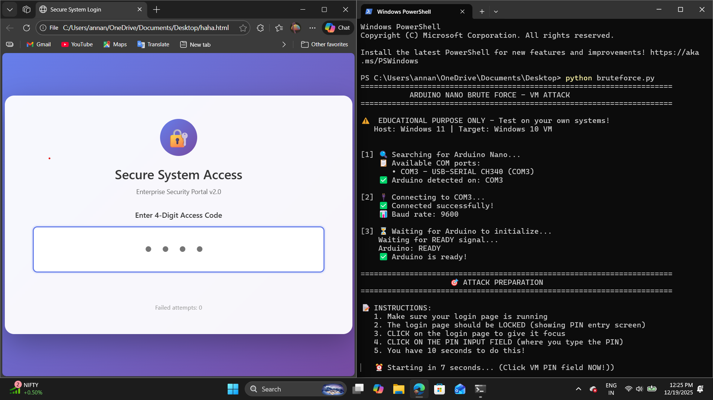
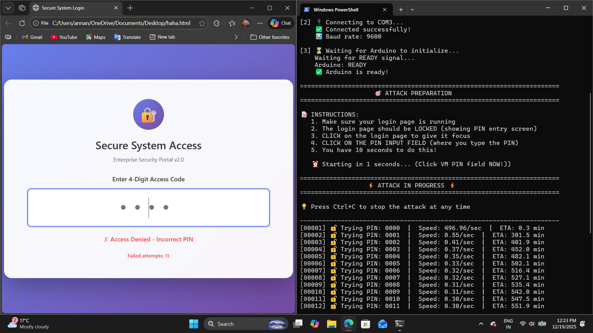
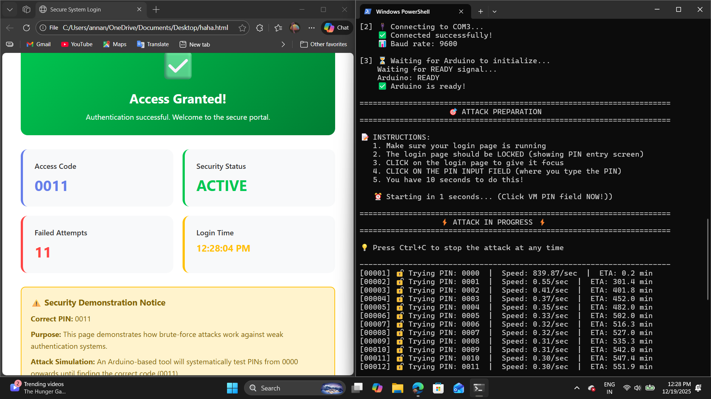

# Arduino Nano Brute Force Demo 🔐

[](https://github.com)
[](LICENSE)
[](https://www.arduino.cc/)
[](https://www.python.org/)

A security demonstration project showing how brute-force attacks work against weak 4-digit PIN authentication systems using an Arduino Nano as a USB HID emulator.





## ⚠️ Disclaimer

**FOR EDUCATIONAL PURPOSES ONLY**

This project is designed to demonstrate security vulnerabilities in weak authentication systems. Only use this on systems you own or have explicit permission to test. Unauthorized access to computer systems is illegal.

## 🎯 Project Overview

This demonstration consists of three components:

1. **HTML Login Page** - A mock secure login interface with 4-digit PIN authentication
2. **Arduino Nano** - Generates and sends PIN attempts (0000-9999) via serial
3. **Python Controller** - Reads PINs from Arduino and simulates keyboard input to test them

### How It Works

```
Arduino Nano → Serial USB → Python Script → Keyboard Simulation → Login Page
   (0000-9999)    (COM3)      (pynput)        (typing PINs)      (validates)
```

The attack succeeds on PIN `0011` after approximately 12 attempts, demonstrating why short PINs are insecure.

## 📋 Requirements

### Hardware
- **Arduino Nano** (or compatible board with USB serial)
- **USB Cable** (for connection to computer)
- **Windows PC** (tested on Windows 10/11)

### Software
- **Arduino IDE** 1.8+ or 2.0+
- **Python** 3.8 or higher
- **Python Libraries:**
  - `pyserial` - Serial communication
  - `pynput` - Keyboard control

## 🚀 Quick Start

### 1. Clone the Repository

```bash
git clone https://github.com/yourusername/arduino-bruteforce-demo.git
cd arduino-bruteforce-demo
```

### 2. Setup Arduino

1. Open `arduino/bruteforce_generator.ino` in Arduino IDE
2. Connect your Arduino Nano via USB
3. Select **Tools → Board → Arduino Nano**
4. Select **Tools → Port → COM# (Your Arduino Port)**
5. Upload the sketch (Ctrl+U)

### 3. Setup Python Environment

```bash
# Install required packages
pip install -r requirements.txt

# Verify installation
python -c "import serial, pynput; print('✓ All packages installed')"
```

### 4. Run the Demo

```bash
# Step 1: Open the HTML login page
# Double-click: web/bruteforce_test.html
# Or open in browser: file:///path/to/bruteforce_test.html

# Step 2: Run the Python script
python bruteforce.py

# Step 3: Follow on-screen instructions
# - Click on the login page PIN input field
# - Wait for attack to start (10 second countdown)
# - Watch as it tries PINs automatically
```

## 📁 Project Structure

```
arduino-bruteforce-demo/
│
├── arduino/
│   └── bruteforce_generator.ino    # Arduino sketch (PIN generator)
│
├── python/
│   └── bruteforce.py                # Python attack script
│
├── web/
│   └── bruteforce_test.html         # Test login page
│
├── docs/
│   ├── demo-screenshot.png          # Screenshots
│   ├── SETUP.md                     # Detailed setup guide
│   └── SECURITY_LESSONS.md          # Security insights
│
├── requirements.txt                 # Python dependencies
├── README.md                        # This file
└── LICENSE                          # MIT License
```

## 🎮 Usage Example

```bash
$ python bruteforce.py

======================================================================
           ARDUINO NANO BRUTE FORCE - VM ATTACK
======================================================================

⚠️  EDUCATIONAL PURPOSE ONLY - Test on your own systems!
   Host: Windows 11 | Target: Windows 10 VM

[1] 🔍 Searching for Arduino Nano...
    📋 Available COM ports:
       • COM3 - USB-SERIAL CH340 (COM3)
    ✅ Arduino detected on: COM3

[2] 🔌 Connecting to COM3...
    ✅ Connected successfully!
    📊 Baud rate: 9600

[3] ⏳ Waiting for Arduino to initialize...
    Waiting for READY signal...
    Arduino: READY
    ✅ Arduino is ready!

======================================================================
                    🎯 ATTACK PREPARATION
======================================================================

📢 INSTRUCTIONS:
   1. Make sure your LOGIN PAGE is running
   2. The LOGIN PAGE should be LOCKED (showing PIN entry screen)
   3. CLICK on the LOGIN PAGE to give it focus
   4. CLICK ON THE PIN INPUT FIELD (where you type the PIN)
   5. You have 10 seconds to do this!

   ⏰ Starting in 1 seconds... (Click LOGIN PIN field NOW!)

======================================================================
                  ⚡ ATTACK IN PROGRESS ⚡
======================================================================

💡 Press Ctrl+C to stop the attack at any time

----------------------------------------------------------------------
[00001] 🔑 Trying PIN: 0000  |  Speed: 0.33/sec  |  ETA: 502.1 min
[00002] 🔑 Trying PIN: 0001  |  Speed: 0.33/sec  |  ETA: 501.4 min
[00003] 🔑 Trying PIN: 0002  |  Speed: 0.33/sec  |  ETA: 500.8 min
...
[00011] 🔑 Trying PIN: 0010  |  Speed: 0.30/sec  |  ETA: 547.4 min
[00012] 🔑 Trying PIN: 0011  |  Speed: 0.30/sec  |  ETA: 551.9 min

✅ Access Granted! (PIN: 0011 found after 12 attempts)
```

## 🔧 Configuration

Edit timing settings in `python/bruteforce.py`:

```python
# ============ CONFIGURATION ============
BAUD_RATE = 9600
DELAY_BETWEEN_DIGITS = 0.15    # Time between typing each digit
DELAY_AFTER_ENTER = 3.0        # Wait time after pressing Enter
# =======================================
```

## 🛡️ Security Lessons

This demonstration teaches several important security concepts:

### Vulnerabilities Demonstrated
- **Short PIN Length**: 4-digit PINs have only 10,000 combinations
- **No Rate Limiting**: System allows unlimited rapid attempts
- **No Account Lockout**: No temporary lockout after failed attempts
- **No CAPTCHA**: No challenge-response to detect automation
- **Predictable Pattern**: Sequential testing (0000, 0001, 0002...)

### Real-World Defenses
✅ **Use Longer PINs/Passwords**: 6+ digits exponentially increases security  
✅ **Implement Rate Limiting**: Slow down attackers (e.g., 3-second delays)  
✅ **Account Lockouts**: Temporary lockout after 3-5 failed attempts  
✅ **Multi-Factor Authentication (MFA)**: Require second verification method  
✅ **CAPTCHA**: Detect and prevent automated attacks  
✅ **Monitoring & Alerts**: Log suspicious activity patterns  

## 📊 Attack Statistics

For the test PIN `0011`:
- **Expected Attempts**: 12 (worst case: 10,000)
- **Time per Attempt**: ~3 seconds
- **Total Attack Time**: ~36 seconds
- **Success Rate**: 100% (if enough time given)

For all 10,000 PINs:
- **Estimated Time**: ~8.3 hours at 0.33 attempts/sec
- **Faster with optimization**: ~1-2 hours possible

## 🔍 Troubleshooting

### Arduino Not Detected
```bash
# Check if Arduino is connected
# Windows: Device Manager → Ports (COM & LPT)
# Look for "USB-SERIAL CH340" or similar

# Try different USB ports
# Close Arduino IDE (it locks the COM port)
# Reinstall CH340 drivers if needed
```

### Python Script Errors
```bash
# Permission Error: Run as Administrator
# Import Error: Reinstall packages
pip install --upgrade pyserial pynput

# Keyboard not working: Check input focus on target window
```

### Attack Not Working
- Ensure login page has focus (click on it)
- Ensure PIN input field is active (click in the input box)
- Check timing delays (might need adjustment)
- Verify Arduino is sending PINs (check serial monitor)

## 🤝 Contributing

Contributions are welcome! Please feel free to submit pull requests or open issues for:
- Bug fixes
- Feature enhancements
- Documentation improvements
- Additional security demonstrations

## 📄 License

This project is licensed under the MIT License - see the [LICENSE](LICENSE) file for details.

## 📚 Educational Resources

- [OWASP Authentication Cheat Sheet](https://cheatsheetseries.owasp.org/cheatsheets/Authentication_Cheat_Sheet.html)
- [NIST Digital Identity Guidelines](https://pages.nist.gov/800-63-3/)
- [Arduino Serial Communication](https://www.arduino.cc/reference/en/language/functions/communication/serial/)
- [Python Serial Documentation](https://pyserial.readthedocs.io/)

## 👨‍💻 Author

Created for educational and security awareness purposes.

## ⭐ Star This Repo

If you found this educational, please consider giving it a star! It helps others discover this security demonstration.

---

**Remember**: With great power comes great responsibility. Use this knowledge to build more secure systems, not to break them. 🛡️
